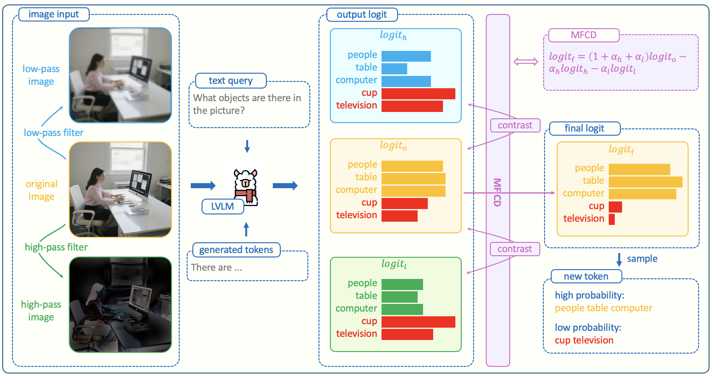

# Multi-Frequency Contrastive Decoding

## MFCD



# Project Structure
- MFCD Decoding method: transformers/generation/utils.py - GenerationMixin._multi_frequency_contrastive_generation
- MFCD Processor class: processor/processor.py - MFCDProcessor

##  model and dataset
model:
* LLaVA-1.5: [Huggingface](https://huggingface.co/llava-hf/llava-1.5-7b-hf)
* LLaVA-NeXT: [Huggingface](https://huggingface.co/llava-hf/llama3-llava-next-8b-hf)
* Qwen-2.5-VL: [Huggingface](https://huggingface.co/Qwen/Qwen2.5-VL-7B-Instruct)

dataset:
* POPE: [Huggingface](https://huggingface.co/datasets/lmms-lab/POPE)

## eval demo
Before running the evaluation code, the following preparations are required:
* The terminal is in the project root directory.
* Save model files and dataset files locally.
* All dependencies in requirements.txt have been installed.
* At least one NVIDIA GPU with CUDA memory of 48GB or more.
* The computer can access the public network.


Next are the common parameters used for all evaluation datasets:
* --max-new-tokens: Max number of new tokens.
* --model-name-or-path: The name or path of the model to evaluate.
* --model-type: The model to evaluate(choices: \[qwen2.5-vl, llava-1.5, llava-next\]).
* --num-workers: The number of parallel workers to prepare dataset.
* --eval-batch-size: The batch size for evaluation.
* --device: The device to evaluate on.
* --temperature: The temperature in generation.
* --top-p: The top p in generation.
* --top-k: The top k in generation.
* --mfc-high-alpha: The high alpha in mfc generation.
* --mfc-low-alpha: The low alpha in mfc generation.
* --mfc-beta: The beta in mfc generation.
* --mfc-jsd: Whether to use the jsd in mfc generation.
* --mfc-entropy: Whether to use the entropy in mfc.
* --mfc-high-pass-cutoff: The high cutoff in mfc processor.
* --mfc-low-pass-cutoff: The low cutoff in mfc processor.
* --mfc-filter-type: The type of filter in mfc processor.

### pope

Next are the parameters dedicated to evaluating the POPE dataset:
* --dataset-path: The path of the locally saved lmms-lab/POPE.
* --pope-type: The type of pope (choices: \[random, popular, adversarial\]).
* --log-path: The path to save the logs.

**MFCD**:

```shell
export PYTHONPATH=$PYTHONPATH:./

python eval/pope/eval.py \
--dataset-path resource/dataset/POPE \
--model-name-or-path resource/model/llava-1.5-7b-hf \
--model-type llava-1.5 \
--num-workers 1 \
--log-path ./pope-output/llava-mfc-random.json \
--device cuda:0 \
--pope-type random \
--temperature 1.2 \
--top-k 50 \
--top-p 1.0 \
--eval-batch-size 4 \
--max-new-tokens 2048 \
--mfc-high-alpha 1.0 \
--mfc-low-alpha 1.0 \
--mfc-beta 0.3 \
--mfc-high-pass-cutoff 0.1 \
--mfc-low-pass-cutoff 0.9 \
--mfc-filter-type gaussian \
--mfc-jsd false \
--mfc-entropy false
```

**MDCD-Plus**:

```shell
export PYTHONPATH=$PYTHONPATH:./

python eval/pope/eval.py \
--dataset-path resource/dataset/POPE \
--model-name-or-path resource/model/llava-1.5-7b-hf \
--model-type llava-1.5 \
--num-workers 1 \
--log-path ./pope-output/llava-mfc-random.json \
--device cuda:0 \
--pope-type random \
--temperature 1.2 \
--top-k 50 \
--top-p 1.0 \
--eval-batch-size 4 \
--max-new-tokens 2048 \
--mfc-high-alpha 1.0 \
--mfc-low-alpha 1.0 \
--mfc-beta 1.0 \
--mfc-high-pass-cutoff 0.1 \
--mfc-low-pass-cutoff 0.9 \
--mfc-filter-type gaussian \
--mfc-jsd true \
--mfc-entropy true
```

## another use

For other uses, please refer to the following code:

```python
import torch

from PIL import Image

from transformers import LlavaForConditionalGeneration, GenerationConfig
from processor import MFCDProcessor


def main():
    # pretrained model name or path
    model_name_or_path = "llava-hf/llava-1.5-7b-hf"
    # device to use
    device = torch.device("cuda:0" if torch.cuda.is_available() else "cpu")

    processor = MFCDProcessor.from_pretrained(
        pretrained_model_name_or_path=model_name_or_path,
        use_fast=True,
        high_pass_cutoff=0.1,
        low_pass_cutoff=0.9,
        device=device,
    )

    image = Image.open('./test.jpg')
    conversation = [
        {
            "role": "user",
            "content": [
                {
                    "type": "image",
                },
                {
                    "type": "text",
                    "text": "Please describe this image in detail."
                }
            ]
        }
    ]

    query = processor.apply_chat_template(
        conversation=conversation,
        tokenize=False,
        add_generation_prompt=False,
    ),

    inputs = processor.__call__(
        text=query,
        images=image,
        return_tensors="pt",
        padding=True,
        padding_side="left",
    )

    model = LlavaForConditionalGeneration.from_pretrained(
        pretrained_model_name_or_path=model_name_or_path,
    ).to(device=device)

    inputs = inputs.to(device=model.device, dtype=model.dtype)

    # mfc_low_alpha or mfc_high_alpha or mfc_beta will trigger mfcd method
    generation_config = GenerationConfig(
        temperature=1.2,
        do_sample=True,
        use_cache=True,
        max_new_tokens=4096,
        mfc_low_alpha=1.0,
        mfc_high_alpha=1.0,
        mfc_beta=1.0,
        mfc_jsd=True,
        mfc_entropy=True,
    )

    with torch.inference_mode():
        outputs = model.generate(
            **inputs,
            generation_config=generation_config
        )

    responses = []
    responses.extend(
        (
            processor.decode(outputs[i][inputs["input_ids"][i].shape[0]:], skip_special_tokens=True)
            for i in range(outputs.size(0))
        )
    )

    print("\n\n".join(responses))


if __name__ == '__main__':
    main()
```
